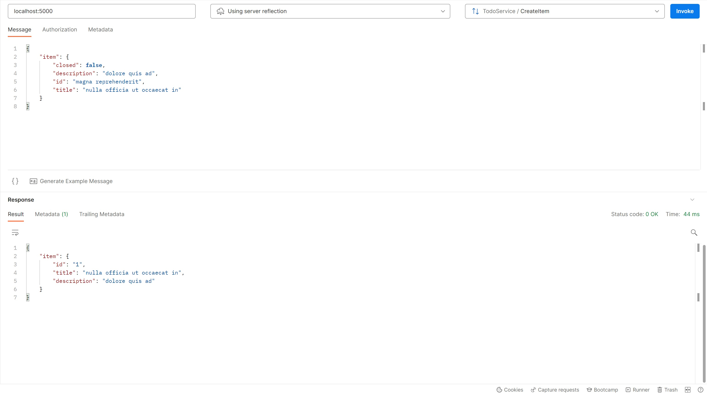

[Postman](https://www.postman.com/product/what-is-postman/) is now permitting gRPC connection. If you intend to use it, don't forget to add the certificates by going into the settings. You'll find it there :
```console
mkcert -CAROOT
```

We implemented server reflection, so the services and messages are directly avalaible to the client.



You can also use [grpcul](https://github.com/fullstorydev/grpcurl), and use a curl like command to invoke the gRPC server :

```console
grpcurl localhost:4000 server.TodoService.GetItems
# Response
{
  "items": [
    {
      "id": "4",
      "title": "Envoy",
      "description": "Create the envoy tutorial"
    },
    {
      "id": "5",
      "title": "Svelte",
      "description": "Create the svelte tutorial"
    },
    {
      "id": "6",
      "title": "gRPC-Web",
      "description": "Explain why we use grpc web"
    },
    {
      "id": "7",
      "title": "Server",
      "description": "Create the server tutorial",
      "closed": true
    }
  ]
}
```

[Continue](/README.md#golang)
